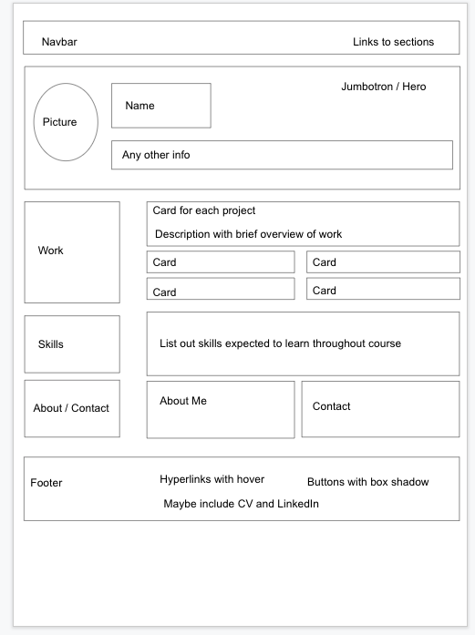

# Bootstrap-Portfolio
Bootsrap Portfolio Challenge - created using [Bootstrap 4](https://getbootstrap.com/docs/4.0/getting-started/introduction/)

## Description
I previously learnt about creating a portfolio site using HTML and CSS, this week I used Bootstrap skills to create a similar page. Overall I found this to be a lot more efficient.

## Table of Contents

* [Deployed Page](#deployed-page)
* [Process](#process)
* [Additional Notes](#additional-notes)
* [Credits](#credits)
* [License](#license)

# Deployed Page

* [Deployed Page Link](https://lilibear1.github.io/Bootstrap-Portfolio/)

    

* [Git Page Link](https://github.com/LiliBear1/Bootstrap-Portfolio) 

## Process

After looking through the requirements of the task i thought it was best to start off with a wireframe:

I created this so it would help me piece together what the requirements were and envision how to put this together. I could clearly see what Bootstrap Elements I would require and where I would need to consider css elements, grids, cards and links.

## Additional notes

Overall, I think I can and i will improve on this page over time, the basics are there and I have used a few placeholders in terms of images and links as well as a dummy phone number and email, but I'm excited to see this develop over time.

## Credits 
2022 Trilogy Education Services, LLC

## License

An [MIT license](https://choosealicense.com/licenses/mit/) was used.